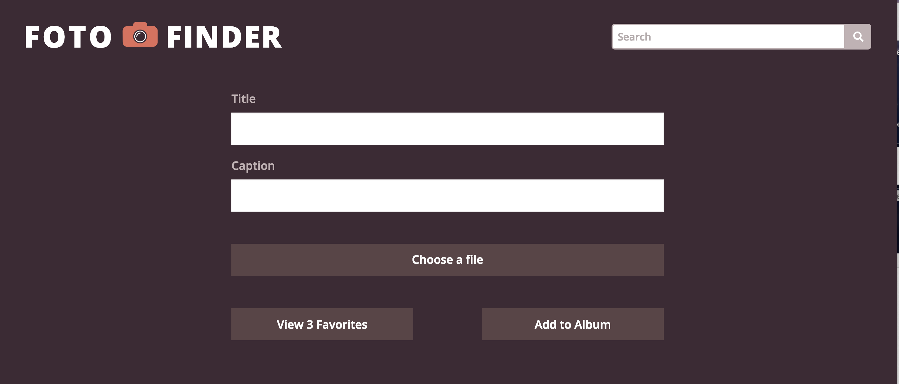
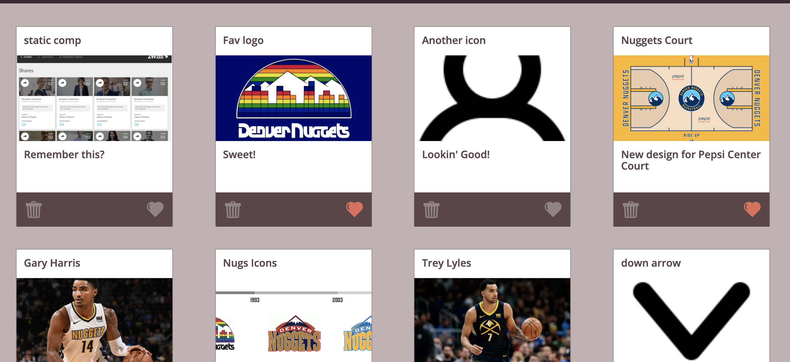
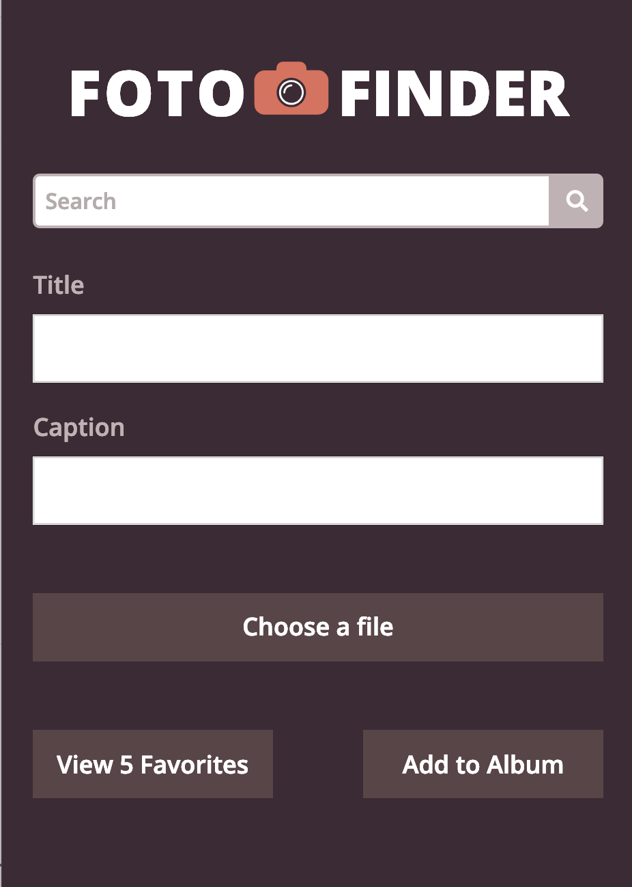
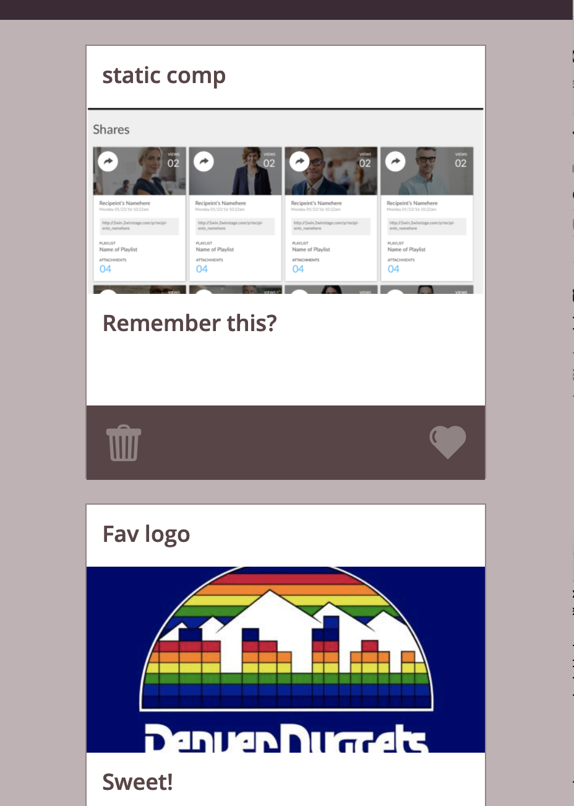

# Fotofinder
FotoFinder is an individual project that served as the final for Mod 1 of Turing school. We were asked to make a photo sharing website based on a given comp. To do this, we used needed to use local storage to save instances of photos in an array. We faced challenges such as making these photo cards searchable and sortable by their favorite status.

##What I gained

##Screenshots
Here is the design we were asked to recreate:

Here is how it should look on a mobile device:

Here is my site:

Here is how mine looks on smaller screen:

