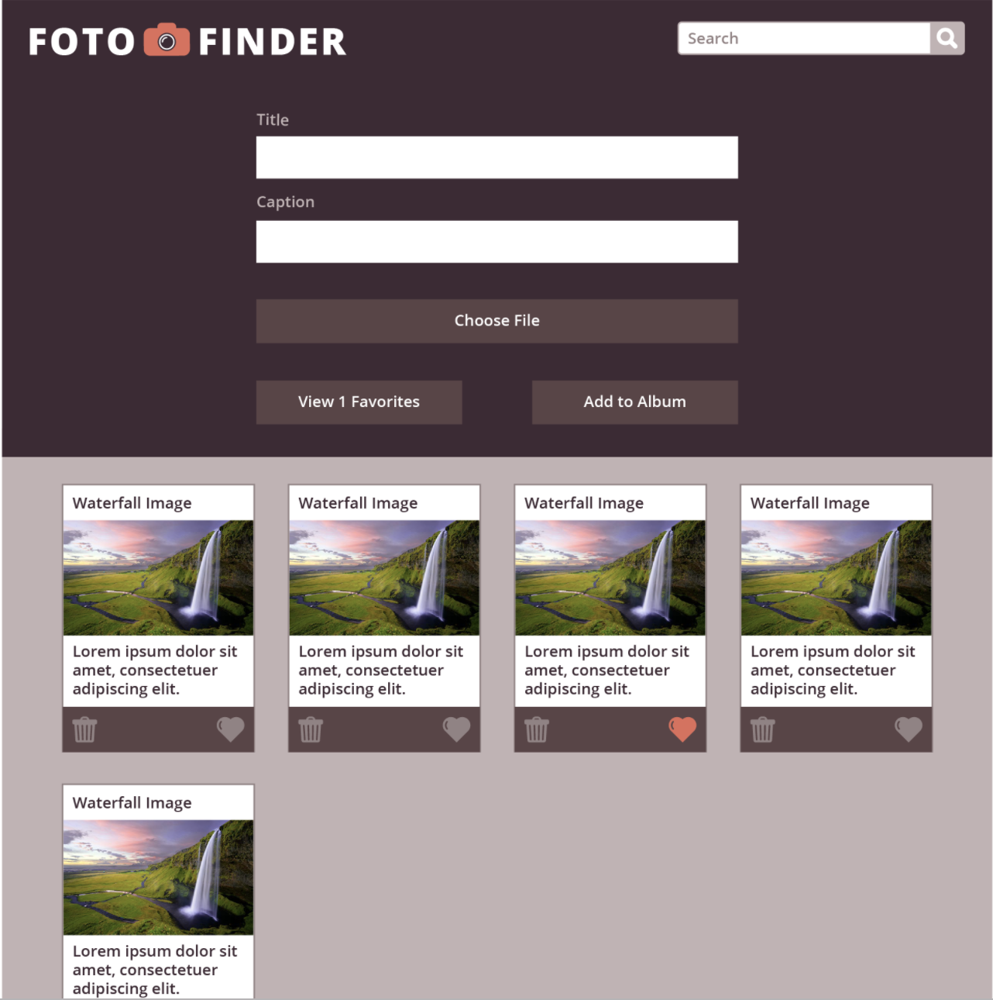
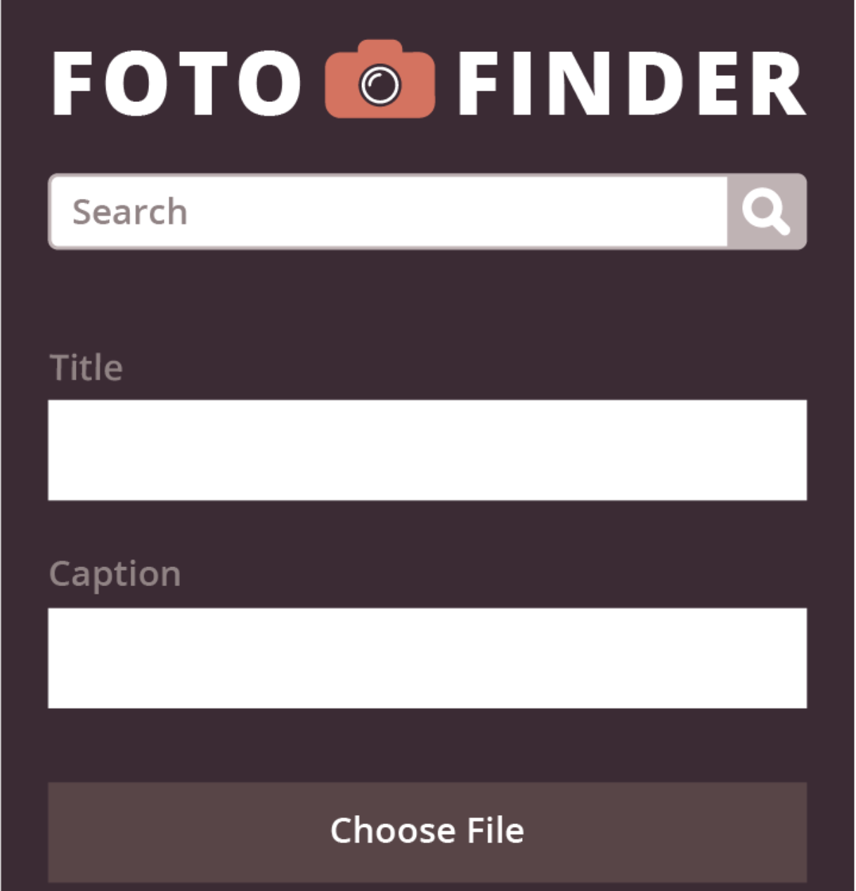
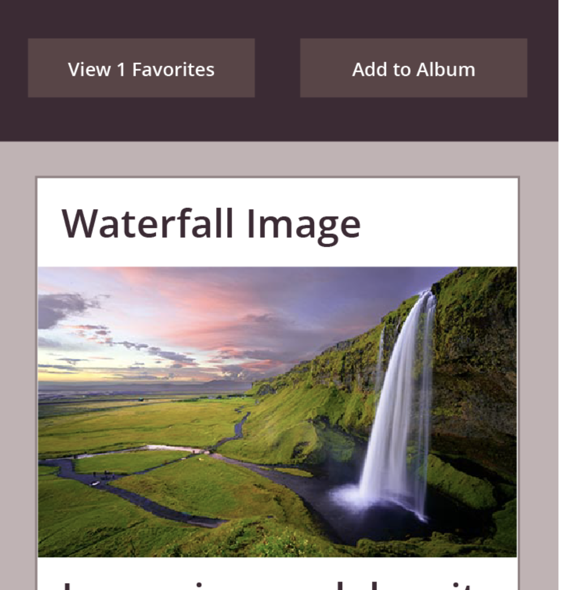

# Fotofinder
FotoFinder is a project for of Turing school that served as a final for our first module. We were asked to make a photo sharing website that saves photos to local storage based on a design provided to us.  Based on the comp, the photo cards should be searchable and sortable based upon whether they are 'favorited' or not. 

## Check it out
[Fotofinder on github-pages](https://francepack.github.io/foto-finder/)

## Screenshots
#### My site:

#### Mobile View:

#### Comp design:

#### Mobile Comp:

## Learning Goals
This project challenged me to work on my own to break down JS logic and functionality. While I had success finding a way to make a photo a 'favorite' and have that status save to local storage, and additionally be able to filter the photos by this status, I was frustrated that I struggled to make editable fields save to storage the way I wanted, though I pushed and made more progess here than I initially thought. I feel one more day of consulting peers would have gotten me there, but this project was a tough lesson in time management, and prioritizing tasks. While I did not accomplish everything I set out to, I feel pretty good about some of the functionality I did achieve. Like all my projects thus far, this experience has helped me learn, grow as a coder, and reveal next steps in improvement.
